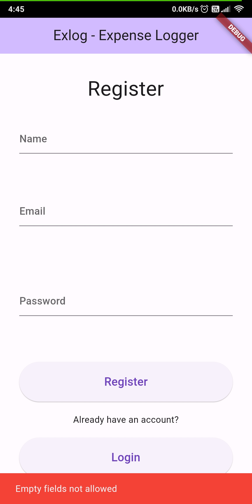
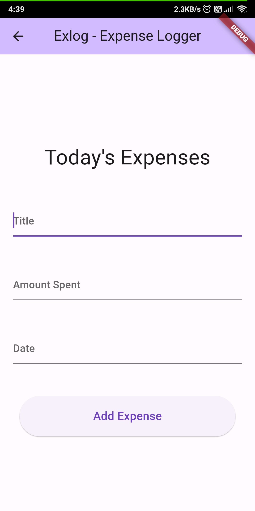

# Exlog - Expense logger

Flutter expense tracker app made as a mini project in sem3.

## Technologies used

- FrontEnd: Flutter
- Database: SQLite

## App Screenshots

|  |   |   |   |
| -------------------------- | -------------------------- | -------------------------- | -------------------------- |

  

Run any Flutter repository on Zapp website: <a href="https://zapp.run/assets/homepage/import-github.gif">refer this link </a>

List of all Flutter apps: <a href="https://github.com/Rahullkumr/Flutter-Projects-List">click here</a>
